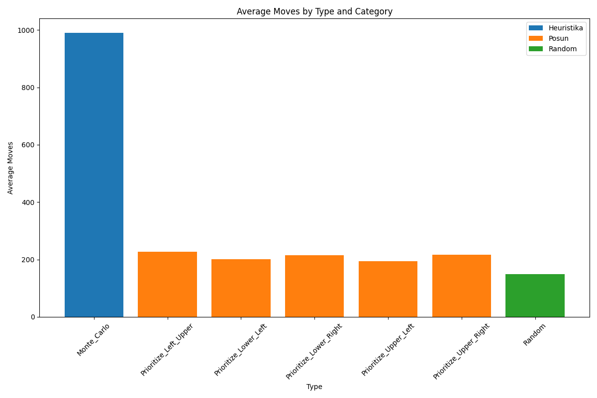
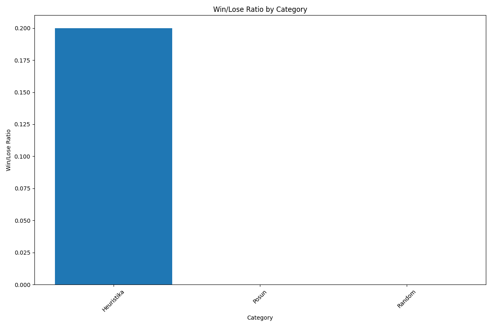

# 2048 Solver

Algoritmy Random a Heuristic hru nevyhrály v žádném testovacím případě.
Monte Carlo dosáhlo výhry ve 20 % případů.

#### Pro algoritmus Monte Carlo bylo použito:

- Počet simulací (num_simulations) = 100
- Maximální počet tahů (max_moves) = 1000 \
Vyšší počet simulací a tahů zvýšil šanci na výhru, ale vedl ke značné výpočetní náročnosti. 

Average mover
------
----

Average score
------
----

Score distribution
------
----

Win rate
------
----

